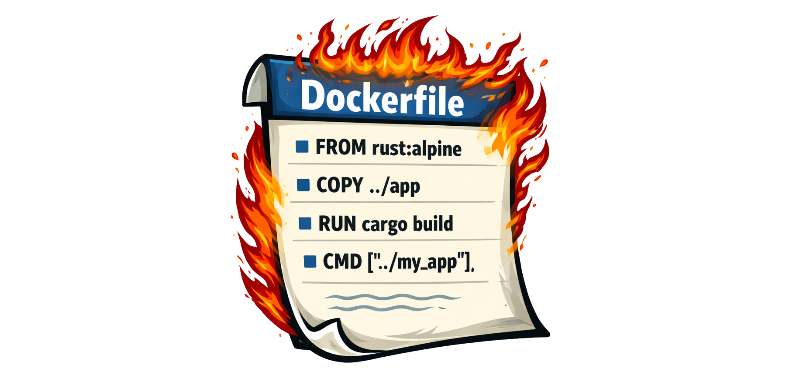
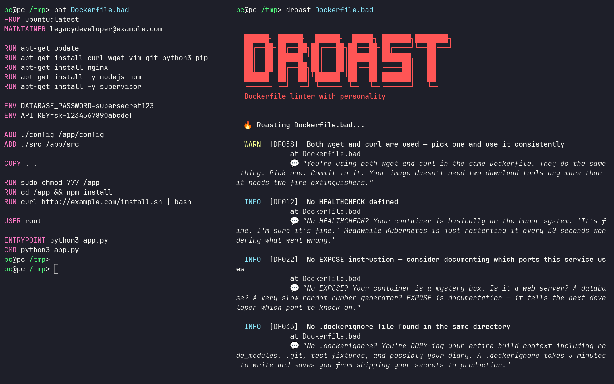

# droast

a dockerfile linter that actually has opinions. it catches bad practices and tells you about them in the least diplomatic way possible.

think of it as code review from a senior dev who's seen too many prod incidents and has stopped being polite about it.

## vs code extension

install from the marketplace and get inline squiggles as you type:

**[droast — Dockerfile Linter](https://marketplace.visualstudio.com/items?itemName=ImmanuelTikhonov.droast)**

requires the `droast` binary to be installed (see below). findings appear in real time with roast messages on hover.

## install

**one-liner** (macOS and Linux, detects Homebrew automatically):

```bash
curl -fsL ewry.net/droast/install.sh | sh
```

**Homebrew** (macOS and Linux):

```bash
brew tap immanuwell/droast https://github.com/immanuwell/homebrew-droast.git
brew install immanuwell/droast/droast
```

**from source:**

```bash
cargo install dockerfile-roast
```

or grab a prebuilt binary from the releases page if you'd rather not wait for the rust compiler to do its thing.

## usage

```bash
# the basics
droast Dockerfile

# lint an entire project
droast **/Dockerfile

# boring mode (no roasts, just facts)
droast --no-roast Dockerfile

# only care about real problems
droast --min-severity warning Dockerfile

# disagree with a rule? valid, we respect it
droast --skip DF001,DF012 Dockerfile

# ci-friendly output
droast --format github Dockerfile    # github actions annotations
droast --format json Dockerfile      # machine-readable
droast --format compact Dockerfile   # one line per finding
droast --format sarif Dockerfile     # SARIF 2.1.0 for GitHub Advanced Security / IDEs
```

## configuration

droast works out of the box with zero configuration. for teams that want to commit project-level defaults, drop a `droast.toml` in the repo root:

```toml
# droast.toml — all fields optional
skip        = ["DF012", "DF022"]  # rules to suppress project-wide
min-severity = "warning"          # hide info-level findings
no-roast    = false               # true = technical output only
no-fail     = false               # true = never block CI
format      = "terminal"          # terminal | json | github | compact
```

droast searches for `droast.toml` starting from the current directory, walking up to the nearest `.git` root. CLI flags always take precedence over the file — the file just sets the defaults so you don't repeat yourself.

`skip` is the most useful field for CI pipelines: add rules your team has consciously accepted (e.g. you ship without HEALTHCHECK by design) so developers don't drown in noise they can't act on.

## github action

add droast to any repo in 5 lines:

```yaml
- uses: immanuwell/dockerfile-roast@1.0.0
```

full example (`.github/workflows/lint.yml`):

```yaml
name: Lint Dockerfiles

on: [push, pull_request]

jobs:
  droast:
    runs-on: ubuntu-latest
    steps:
      - uses: actions/checkout@v4
      - uses: immanuwell/dockerfile-roast@1.0.0
```

findings show up as inline annotations on the PR diff. no configuration required.

available inputs (all optional):

| input | default | description |
|-------|---------|-------------|
| `files` | `Dockerfile` | file(s) or glob to lint |
| `min-severity` | `info` | `info`, `warning`, or `error` |
| `skip` | — | comma-separated rule IDs to ignore |
| `no-roast` | `false` | technical output only, no jokes |
| `no-fail` | `false` | advisory mode — never blocks the build |
| `image-tag` | `latest` | pin to a specific droast release, e.g. `1.0.0` |

example with options:

```yaml
- uses: immanuwell/dockerfile-roast@1.0.0
  with:
    files: '**/Dockerfile'
    min-severity: warning
    skip: DF012,DF022
    no-fail: true        # report findings but don't block the PR
```

## docker

pull from ghcr and use immediately, no install needed:

```bash
# lint a Dockerfile in the current directory
docker run --rm -v "$(pwd)/Dockerfile":/Dockerfile ghcr.io/immanuwell/droast /Dockerfile

# lint any file, anywhere
docker run --rm -v /path/to/your/Dockerfile:/Dockerfile ghcr.io/immanuwell/droast /Dockerfile

# pass flags as usual
docker run --rm -v "$(pwd)/Dockerfile":/Dockerfile ghcr.io/immanuwell/droast \
    --no-roast --min-severity warning /Dockerfile
```

or build locally from source:

```bash
docker build -t droast .
docker run --rm -v "$(pwd)/Dockerfile":/Dockerfile droast /Dockerfile
```

the image is published automatically to `ghcr.io/immanuwell/droast` on every release tag.

## shell completions

add this once, never mistype `--min-severity` again:

```bash
# bash — add to .bashrc
source <(droast completion bash)

# zsh — add to .zshrc
droast completion zsh > ~/.zfunc/_droast

# fish — add to config.fish
droast completion fish | source
```

## what it catches

63 rules, ngl thats a lot. run `droast --list-rules` for the full breakdown.

<!-- BEGIN RULES -->
<details>
<summary>all 63 rules</summary>

```
  Available Rules

  ID       DESCRIPTION
  ──────────────────────────────────────────────────────────────────────
  DF001    Use specific base image tags instead of 'latest'
  DF002    Do not run as root
  DF011    Use multi-stage builds to reduce image size
  DF013    Avoid storing secrets in ENV variables
  DF014    Avoid hardcoding passwords or tokens in ARG/ENV
  DF020    Set explicit non-root USER
  DF003    Combine RUN commands to reduce layers
  DF004    Clean apt/yum/apk cache in the same RUN layer
  DF005    Pin package versions for reproducibility
  DF006    Avoid ADD for local files; prefer COPY
  DF007    Do not copy the entire build context (COPY . .)
  DF008    Use WORKDIR instead of inline cd commands
  DF009    Use absolute paths in WORKDIR
  DF010    Avoid using sudo inside containers
  DF012    Set HEALTHCHECK for long-running services
  DF017    Use ENTRYPOINT with CMD for flexible images
  DF018    Avoid using shell form for ENTRYPOINT
  DF019    Do not use deprecated MAINTAINER; use LABEL instead
  DF022    Specify EXPOSE for documented ports
  DF023    Avoid multiple FROM without aliases (unintended multistage)
  DF024    Avoid using :latest in FROM even with aliases
  DF025    Use JSON array syntax for CMD/ENTRYPOINT
  DF026    Avoid recursive COPY from root
  DF030    Avoid using pip without --no-cache-dir
  DF031    Avoid npm install without ci/--production for prod images
  DF032    Set PYTHONDONTWRITEBYTECODE and PYTHONUNBUFFERED for Python images
  DF033    Use .dockerignore to exclude unnecessary files
  DF034    Avoid chmod 777 — overly permissive
  DF035    Avoid using curl without --fail flags
  DF036    Avoid Dockerfile with no CMD or ENTRYPOINT
  DF015    Avoid using apt-get without -y flag
  DF016    Use --no-install-recommends with apt-get
  DF021    Avoid wget|sh pipe patterns (execute remote code)
  DF027    Do not use yum without -y flag
  DF028    Cache-bust apt-get update
  DF029    Avoid apk add without --no-cache
  DF037    Dockerfile must begin with FROM, ARG, or a comment
  DF038    Multiple CMD instructions — only the last one takes effect
  DF039    Multiple ENTRYPOINT instructions — only the last one takes effect
  DF040    EXPOSE port must be in valid range 0-65535
  DF041    Multiple HEALTHCHECK instructions — only the last one applies
  DF042    FROM stage aliases must be unique
  DF043    zypper install without non-interactive flag
  DF044    Avoid zypper dist-upgrade in Dockerfiles
  DF045    Run zypper clean after zypper install
  DF046    Run dnf clean all after dnf install
  DF047    Run yum clean all after yum install
  DF048    COPY with multiple sources requires destination to end with /
  DF049    COPY --from must reference a previously defined stage
  DF050    COPY --from cannot reference the current stage
  DF051    Pin versions in pip install
  DF052    Pin versions in apk add
  DF053    Pin versions in gem install
  DF054    Pin versions in go install with @version
  DF055    Run yarn cache clean after yarn install
  DF056    Use wget --progress=dot:giga to avoid bloated build logs
  DF057    Set -o pipefail before RUN commands that use pipes
  DF058    Use either wget or curl consistently, not both
  DF059    Use apt-get or apt-cache instead of apt in scripts
  DF060    Avoid running pointless interactive commands inside containers
  DF061    Do not use --platform in FROM unless required
  DF062    ENV variable must not reference itself in the same statement
  DF063    COPY to relative destination requires WORKDIR to be set first
  DF064    useradd without -l flag may create excessively large images

  Use --skip DF001,DF002 to suppress specific rules.
  Use --min-severity warning to hide INFO findings.
```

</details>
<!-- END RULES -->

the greatest hits:

| rule | crime |
|------|-------|
| DF001 | `FROM ubuntu:latest` — pick an actual tag |
| DF002 | running explicitly as root |
| DF004 | apt cache left in the image (you made a trash can) |
| DF011 | shipping the entire build toolchain to prod |
| DF013 | secrets in ENV vars (in your layers. forever. congrats) |
| DF021 | `curl \| sh` — no. |
| DF028 | split `apt-get update` + install in separate RUN layers |
| DF034 | `chmod 777` somewhere in there |
| DF037 | instruction before FROM (invalid Dockerfile) |
| DF039 | multiple ENTRYPOINT instructions |
| DF046 | dnf install without cache cleanup |
| DF051 | pip install without version pins |
| DF057 | pipe in RUN without `set -o pipefail` |
| DF059 | `apt` used instead of `apt-get` in scripts |
| DF063 | COPY to relative path with no WORKDIR set |

rule categories: base images · security · package managers · layer hygiene · instruction quality · service quality · python/node specifics

## exit codes

`0` = clean (or `--no-fail`), `1` = errors found.

`--no-fail` is useful for advisory CI runs where you want the output but dont want to block the build yet.

## license

MIT. do whatever.
