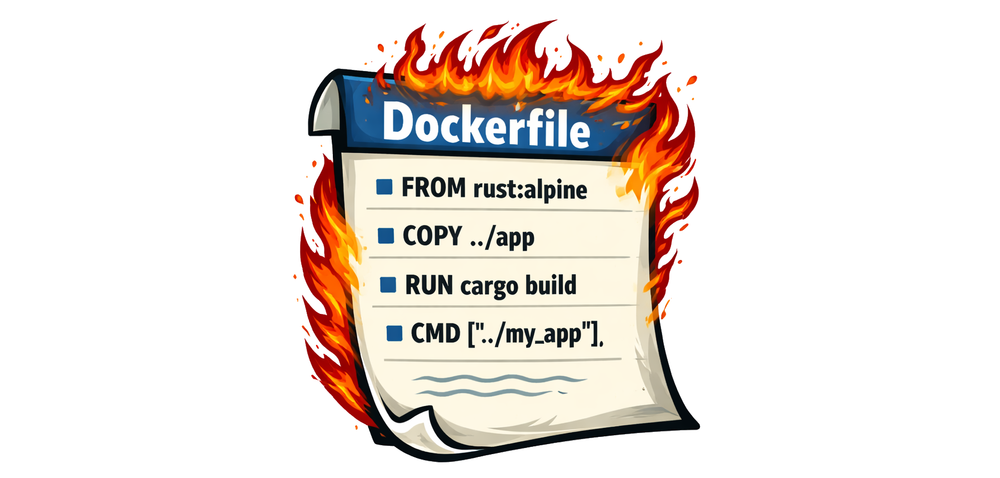
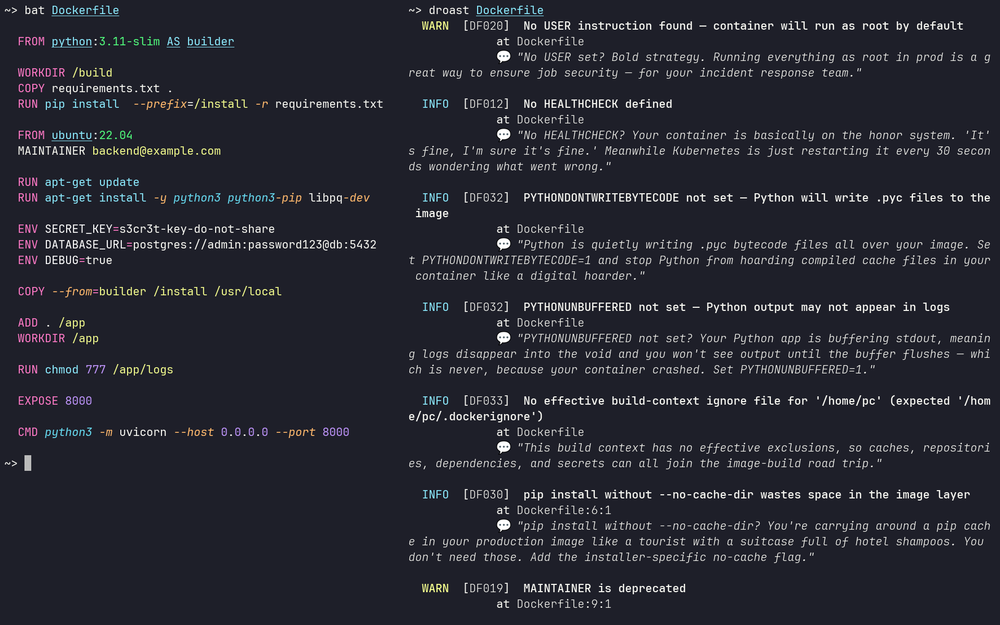
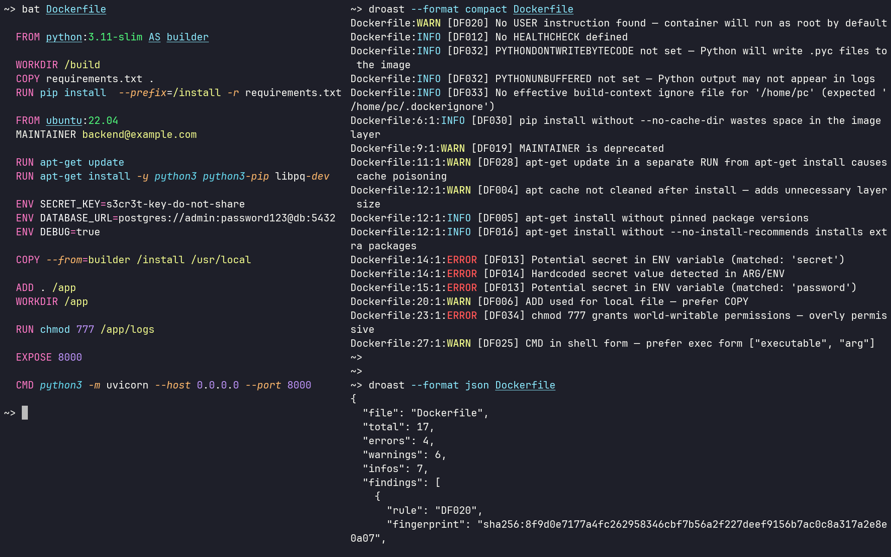
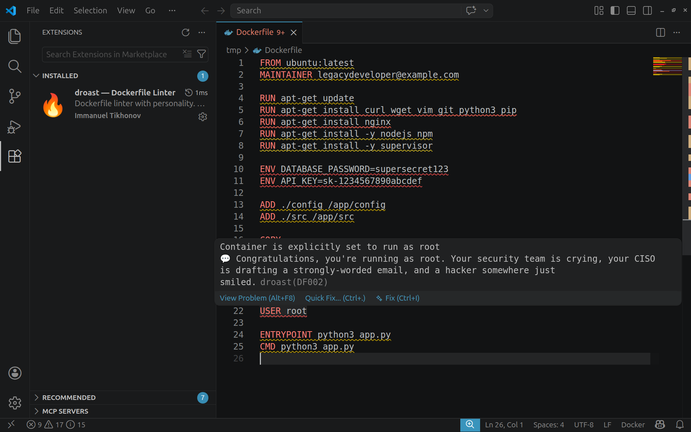
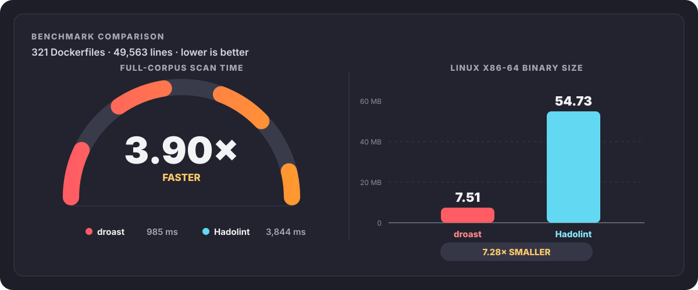

<p align="center">
  <a href="https://crates.io/crates/dockerfile-roast"></a>
  ・
  <a href="https://marketplace.visualstudio.com/items?itemName=ImmanuelTikhonov.droast"></a>
  <br>
  <strong><a href="DOCS.md">docs</a></strong>
  ・
  <a href="https://ewry.net/droast-dockerfile-linter/">site</a>
  ・
  <a href="https://github.com/marketplace/actions/droast-dockerfile-linter">GH action</a>
  ・
  <a href="https://wasmer.io/immanuwell/droast">Wasmer</a>
  ・
  <a href="#comparison-with-other-tools">comparison</a>
</p>









# droast

[](https://crates.io/crates/dockerfile-roast)

a dockerfile linter that actually has opinions. it catches bad practices and tells you about them in the least diplomatic way possible.

think of it as code review from a senior dev who's seen too many prod incidents and has stopped being polite about it.

the span-aware parser understands heredocs, parser and escape directives, shell and JSON forms, BuildKit flags such as `RUN --mount`, Windows paths, and PowerShell — and reports malformed Dockerfile syntax as `DF071`.

## vs code extension

install from the marketplace and get inline squiggles as you type:


**[droast — Dockerfile Linter](https://marketplace.visualstudio.com/items?itemName=ImmanuelTikhonov.droast)**

```bash
code --install-extension ImmanuelTikhonov.droast
```

the binary is bundled — no separate install needed. findings appear in real time with roast messages on hover.

## install

**one-liner** (macOS and Linux, detects Homebrew automatically):

```bash
curl -fsL ewry.net/droast/install.sh | sh
```

**Homebrew** (macOS and Linux):

```bash
brew tap immanuwell/droast https://github.com/immanuwell/homebrew-droast.git
brew install immanuwell/droast/droast
```

**Cargo** ([crates.io](https://crates.io/crates/dockerfile-roast), builds from source):

```bash
cargo install dockerfile-roast
```

**Wasmer** ([Wasmer Registry](https://wasmer.io/immanuwell/droast), sandboxed WASI command):

```bash
wasmer run immanuwell/droast -- --check-dockerignore=false - < Dockerfile
```

To scan files or a repository, explicitly mount the directory into the sandbox:

```bash
wasmer run --volume "$PWD:/workspace" immanuwell/droast -- /workspace
```

or grab a prebuilt binary from the releases page if you'd rather not wait for the rust compiler to do its thing.

## usage

```bash
# the basics
droast Dockerfile

# recursively discover and lint an entire repository
droast .

# boring mode (no roasts, just facts)
droast --no-roast Dockerfile

# only care about real problems
droast --min-severity warning Dockerfile

# disagree with a rule? valid, we respect it
droast --skip DF001,DF012 Dockerfile

# ci-friendly output
droast --format github Dockerfile    # github actions annotations
droast --format json Dockerfile      # machine-readable
droast --format compact Dockerfile   # one line per finding
droast --format sarif Dockerfile     # SARIF 2.1.0 for GitHub Advanced Security / IDEs
```

When given a directory—or no path at all—droast recursively discovers `Dockerfile`, `Dockerfile.*`, `*.Dockerfile`, `Containerfile`, and `Containerfile.*`. It also reads Compose YAML and Docker Bake HCL/JSON files to find non-standard Dockerfile paths and their declared build contexts. In Podman mode, it additionally follows Quadlet `.build`/`.kube` units and local-image `*.kube.yaml` layouts. Repository ignore rules are respected, while hidden project directories such as `.devcontainer` remain discoverable.

For `DF033`, Docker mode uses the effective ignore file Docker would use: `<Dockerfile>.dockerignore` beside the Dockerfile takes precedence over `.dockerignore` at the build-context root. Podman mode instead prefers `.containerignore`, then falls back to `.dockerignore`. Select it with `--engine podman` or `[workflow] engine = "podman"`. Missing, empty, comment-only, and negation-only ignore files are reported; use `--check-ignorefile=false` to disable this context check.

## configuration

droast works out of the box with zero configuration. for teams that want to commit project-level defaults, drop a `droast.toml` in the repo root:

```toml
# droast.toml — all fields optional
preset       = "production"       # minimal | security | performance | production | strict
skip         = ["DF012", "DF022"]
min-severity = "warning"
no-roast     = true

[severity-overrides]
DF020 = "error"

[shellcheck]
mode = "auto" # off (default) | auto | required
exclude = ["SC2086"]

[workflow]
engine = "podman" # docker (default) | podman
```

droast searches for `droast.toml` starting from the current directory, walking up to the nearest `.git` root. CLI flags always take precedence over the file — the file just sets the defaults so you don't repeat yourself.

When ShellCheck is installed, `mode = "auto"` also analyzes shell-form `RUN` instructions and script heredocs, reporting native `SC####` IDs with Dockerfile source locations. The default is `off`; `required` makes a missing or failed ShellCheck executable an `SC0000` error. You can also select the mode for one invocation with `--shellcheck auto`.

To keep lint configuration elsewhere, pass its path explicitly:

```bash
droast --config .lint/droast.toml Dockerfile
```

To migrate a Hadolint policy, generate an equivalent `droast.toml` from its YAML configuration:

```bash
droast init --from-hadolint .hadolint.yaml
```

Compatible settings and Hadolint `DL` rule aliases are imported; Droast reports every setting or rule that has no equivalent so the migration stays reviewable.

Larger teams can add path-specific overrides, rule categories, inherited organization policy, registry and base-image allowlists, required OCI labels, and governed inline suppressions with mandatory reasons and expiration dates:

```dockerfile
# droast ignore=DF001 reason="PLAT-142 migration" expires=2026-09-30
FROM alpine:latest
```

See the **[complete configuration guide](DOCS.md#configuration)** and the copy-paste [`examples/droast-enterprise.toml`](examples/droast-enterprise.toml). None of these controls are required; zero-config behavior stays unchanged.

## github action

<!-- droast:action-version:start -->

add droast to any repo in 5 lines:

```yaml
- uses: immanuwell/dockerfile-roast@1.4.4
```

full example (`.github/workflows/lint.yml`):

```yaml
name: Lint Dockerfiles

on: [push, pull_request]

jobs:
  droast:
    runs-on: ubuntu-latest
    steps:
      - uses: actions/checkout@v4
      - uses: immanuwell/dockerfile-roast@1.4.4
```

findings show up as inline annotations on the PR diff. no configuration required.

available inputs (all optional):

| input | default | description |
|-------|---------|-------------|
| `files` | `Dockerfile` | file(s) or glob to lint |
| `min-severity` | config or `info` | `info`, `warning`, or `error` |
| `preset` | — | `minimal`, `security`, `performance`, `production`, or `strict` |
| `category` | — | comma-separated rule categories to run |
| `skip-category` | — | comma-separated rule categories to skip |
| `skip` | — | comma-separated rule IDs to ignore |
| `no-roast` | `false` | technical output only, no jokes |
| `no-fail` | `false` | advisory mode — never blocks the build |
| `engine` | config or `docker` | build-context conventions: `docker` or `podman` |
| `image-tag` | `latest` | pin to a specific droast release, e.g. `1.4.4` |

example with options:

```yaml
- uses: immanuwell/dockerfile-roast@1.4.4
  with:
    files: '**/Dockerfile'
    preset: production
    skip: DF012,DF022
    no-fail: true        # report findings but don't block the PR
```

<!-- droast:action-version:end -->

## pre-commit

roast Dockerfiles before they even reach CI, via [pre-commit](https://pre-commit.com):

```yaml
- repo: https://github.com/immanuwell/dockerfile-roast
  rev: 1.4.4
  hooks:
    - id: droast
```

the hook runs on `Dockerfile`, `Dockerfile.*`, `*.Dockerfile`, `Containerfile`, and `Containerfile.*`, while excluding Dockerfile-specific `.dockerignore` files. pass flags through `args` as usual:

```yaml
    - id: droast
      args: [--min-severity, warning, --skip, DF012]
```

## docker

pull from ghcr and use immediately, no install needed:

```bash
# lint a Dockerfile in the current directory
docker run --rm -v "$(pwd)/Dockerfile":/Dockerfile ghcr.io/immanuwell/droast /Dockerfile

# lint any file, anywhere
docker run --rm -v /path/to/your/Dockerfile:/Dockerfile ghcr.io/immanuwell/droast /Dockerfile

# pass flags as usual
docker run --rm -v "$(pwd)/Dockerfile":/Dockerfile ghcr.io/immanuwell/droast \
    --no-roast --min-severity warning /Dockerfile
```

or build locally from source:

```bash
docker build -t droast .
docker run --rm -v "$(pwd)/Dockerfile":/Dockerfile droast /Dockerfile
```

the image is published automatically to `ghcr.io/immanuwell/droast` on every release tag.

## podman

the same OCI image works with rootless Podman. Mount the repository with `:Z` on SELinux hosts so Podman can relabel it for the container:

```bash
podman run --rm \
    -v "$PWD:/workspace:Z" \
    -w /workspace \
    ghcr.io/immanuwell/droast \
    --engine podman .
```

`--engine podman` makes `DF033` follow Podman’s `.containerignore`-before-`.dockerignore` precedence; it does not require a Podman daemon or change Dockerfile parsing. Persist that workflow for a repository with:

```toml
[workflow]
engine = "podman"
```

Podman preprocesses `Containerfile.in` with CPP. Droast reports `DF075` as an informational reminder to lint the generated Containerfile as part of that build workflow.

## wasmer

droast is also published as a WASI package in the [Wasmer Registry](https://wasmer.io/immanuwell/droast). It uses the same CLI and rule engine as the native binary.

Lint through stdin without granting filesystem access:

```bash
wasmer run immanuwell/droast -- \
    --check-dockerignore=false --format compact - < Dockerfile
```

Lint a mounted repository:

```bash
wasmer run --volume "$PWD:/workspace" immanuwell/droast -- /workspace
```

Wasmer denies host filesystem access unless a directory is mounted. If the repository uses `droast.toml`, pass `--config /workspace/droast.toml` after the `--` separator.

## shell completions

add this once, never mistype `--min-severity` again:

```bash
# bash — add to .bashrc
source <(droast completion bash)

# zsh — add to .zshrc
droast completion zsh > ~/.zfunc/_droast

# fish — add to config.fish
droast completion fish | source
```

## what it catches

<p data-droast-rule-count>85 rules, ngl thats a lot. run <code>droast --list-rules</code> for the full breakdown.</p>

<!-- BEGIN RULES -->
<details>
<summary data-droast-rule-count>all 85 rules</summary>

```

  Available Rules

  ID       SEVERITY CATEGORIES                         DESCRIPTION
  ──────────────────────────────────────────────────────────────────────────────────────────────────────────────────────
  DF001    WARN     correctness,reproducibility        Use specific base image tags instead of 'latest'
  DF002    ERROR    security                           Do not run as root
  DF011    WARN     performance                        Use multi-stage builds to reduce image size
  DF013    ERROR    security                           Avoid storing secrets in ENV variables
  DF014    ERROR    security                           Avoid hardcoding passwords or tokens in ARG/ENV
  DF020    WARN     security                           Set explicit non-root USER
  DF003    WARN     performance                        Combine RUN commands to reduce layers
  DF004    WARN     performance                        Clean apt/yum/apk cache in the same RUN layer
  DF005    INFO     correctness,reproducibility        Pin package versions for reproducibility
  DF006    WARN     maintainability,performance        Avoid ADD for local files; prefer COPY
  DF007    WARN     performance                        Do not copy the entire build context (COPY . .)
  DF008    INFO     maintainability,performance        Use WORKDIR instead of inline cd commands
  DF009    WARN     correctness,maintainability        Use absolute paths in WORKDIR
  DF010    WARN     security                           Avoid using sudo inside containers
  DF012    INFO     maintainability,reliability        Set HEALTHCHECK for long-running services
  DF017    WARN     maintainability,reliability        Use ENTRYPOINT with CMD for flexible images
  DF018    WARN     correctness,reliability            Avoid using shell form for ENTRYPOINT
  DF019    WARN     correctness,maintainability        Do not use deprecated MAINTAINER; use LABEL instead
  DF022    INFO     maintainability,reliability        Specify EXPOSE for documented ports
  DF023    WARN     correctness,maintainability        Avoid multiple FROM without aliases (unintended multistage)
  DF024    WARN     correctness,reproducibility        Avoid using :latest in FROM even with aliases
  DF025    WARN     correctness,reliability            Use JSON array syntax for CMD/ENTRYPOINT
  DF026    WARN     maintainability,performance        Avoid recursive COPY from root
  DF030    INFO     performance                        Avoid using pip without --no-cache-dir
  DF031    INFO     performance                        Avoid npm install without ci/--production for prod images
  DF032    INFO     maintainability,reliability        Set PYTHONDONTWRITEBYTECODE and PYTHONUNBUFFERED for Python images
  DF033    INFO     performance,security               Use an effective .dockerignore for each build context
  DF034    ERROR    security                           Avoid chmod 777 — overly permissive
  DF035    INFO     maintainability,reliability        Avoid using curl without --fail flags
  DF036    WARN     maintainability,reliability        Avoid Dockerfile with no CMD or ENTRYPOINT
  DF015    ERROR    correctness,reliability            Avoid using apt-get without -y flag
  DF016    INFO     performance                        Use --no-install-recommends with apt-get
  DF021    ERROR    security,supply-chain              Avoid wget|sh pipe patterns (execute remote code)
  DF027    ERROR    correctness,reliability            Do not use yum without -y flag
  DF028    WARN     performance                        Cache-bust apt-get update
  DF029    WARN     performance                        Avoid apk add without --no-cache
  DF037    ERROR    correctness,maintainability        Dockerfile must begin with FROM, ARG, or a comment
  DF038    WARN     correctness,maintainability        Multiple CMD instructions — only the last one takes effect
  DF039    ERROR    correctness,reliability            Multiple ENTRYPOINT instructions — only the last one takes effect
  DF040    ERROR    correctness,reliability            EXPOSE port must be in valid range 0-65535
  DF041    ERROR    correctness,reliability            Multiple HEALTHCHECK instructions — only the last one applies
  DF042    ERROR    correctness,reproducibility        FROM stage aliases must be unique
  DF043    WARN     correctness,maintainability        zypper install without non-interactive flag
  DF044    WARN     correctness,maintainability        Avoid zypper dist-upgrade in Dockerfiles
  DF045    INFO     performance                        Run zypper clean after zypper install
  DF046    WARN     performance                        Run dnf clean all after dnf install
  DF047    WARN     performance                        Run yum clean all after yum install
  DF048    ERROR    correctness,reliability            COPY with multiple sources requires destination to end with /
  DF049    WARN     correctness,reliability            COPY --from must reference a previously defined stage
  DF050    ERROR    correctness,reliability            COPY --from cannot reference the current stage
  DF051    WARN     reproducibility,supply-chain       Pin versions in pip install
  DF052    WARN     reproducibility,supply-chain       Pin versions in apk add
  DF053    WARN     reproducibility,supply-chain       Pin versions in gem install
  DF054    WARN     reproducibility,supply-chain       Pin versions in go install with @version
  DF055    INFO     performance                        Run yarn cache clean after yarn install
  DF056    INFO     maintainability,performance        Use wget --progress=dot:giga to avoid bloated build logs
  DF057    WARN     reliability,security               Set -o pipefail before RUN commands that use pipes
  DF058    WARN     maintainability,performance        Use either wget or curl consistently, not both
  DF059    WARN     correctness,maintainability        Use apt-get or apt-cache instead of apt in scripts
  DF060    INFO     maintainability,reliability        Avoid running pointless interactive commands inside containers
  DF061    WARN     correctness,maintainability        Do not use --platform in FROM unless required
  DF062    ERROR    correctness,reproducibility        ENV variable must not reference itself in the same statement
  DF063    WARN     correctness,maintainability        COPY to relative destination requires WORKDIR to be set first
  DF064    WARN     performance                        useradd without -l flag may create excessively large images
  DF065    WARN     reproducibility,supply-chain       FROM uses an unrecognised image registry
  DF066    WARN     reliability,security               Bash-specific syntax used without a SHELL instruction
  DF067    INFO     maintainability,performance        COPY of a local archive — ADD auto-extracts tarballs
  DF068    ERROR    correctness,reliability            FROM, ONBUILD, and MAINTAINER are forbidden as ONBUILD triggers
  DF069    WARN     correctness,reproducibility        Avoid apt-get upgrade / dist-upgrade — makes builds non-reproducible
  DF070    WARN     performance                        Avoid broad COPY before package install — invalidates Docker layer cache
  DF071    ERROR    correctness,reliability            Dockerfile syntax must be valid
  DF072    ERROR    correctness,security               Suppression directives must satisfy policy
  DF073    ERROR    reproducibility,supply-chain       Base images must satisfy the approved image policy
  DF074    ERROR    correctness,security               Image labels must satisfy the configured schema
  DF075    INFO     correctness,reliability            Containerfile.in must be linted after Podman CPP preprocessing
  DF076    WARN     correctness,reliability            Use a consistent casing style for Dockerfile instructions
  DF077    ERROR    correctness,reliability            Do not COPY or ADD files excluded from the build context
  DF078    WARN     correctness,reliability            Use lowercase protocol names in EXPOSE
  DF079    WARN     correctness,reliability            Match AS casing to FROM in multi-stage builds
  DF082    WARN     correctness,reliability            Use key=value syntax for ENV and LABEL
  DF083    WARN     correctness,reproducibility        Do not set FROM --platform to the default target platform
  DF084    ERROR    correctness,reliability            Do not use reserved Dockerfile stage names
  DF085    WARN     correctness,reliability            Use lowercase multi-stage build names
  DF086    ERROR    correctness,reliability            Declare ARG variables used by FROM before the first FROM
  DF087    ERROR    correctness,reliability            Declare Dockerfile variables before using them

  Use --skip DF001,DF002 to suppress specific rules.
  Use --min-severity warning to hide INFO findings.
```

</details>
<!-- END RULES -->

the greatest hits:

| rule | crime |
|------|-------|
| DF001 | `FROM ubuntu:latest` — pick an actual tag |
| DF002 | running explicitly as root |
| DF004 | apt cache left in the image (you made a trash can) |
| DF011 | shipping the entire build toolchain to prod |
| DF013 | secrets in ENV vars (in your layers. forever. congrats) |
| DF021 | `curl \| sh` — no. |
| DF028 | split `apt-get update` + install in separate RUN layers |
| DF034 | `chmod 777` somewhere in there |
| DF037 | instruction before FROM (invalid Dockerfile) |
| DF039 | multiple ENTRYPOINT instructions |
| DF046 | dnf install without cache cleanup |
| DF051 | pip install without version pins |
| DF057 | pipe in RUN without `set -o pipefail` |
| DF059 | `apt` used instead of `apt-get` in scripts |
| DF063 | COPY to relative path with no WORKDIR set |

rule categories: base images · security · package managers · layer hygiene · instruction quality · service quality · python/node specifics

## exit codes

`0` = clean (or `--no-fail`), `1` = errors found.

`--no-fail` is useful for advisory CI runs where you want the output but dont want to block the build yet.

## license

MIT. do whatever.

## comparison with other tools



<details>
<summary>benchmark methodology and detailed results</summary>

The comparison used droast 1.4.4 and Hadolint 2.14.0 on Ubuntu 24.04.4 LTS x86-64.

Both tools scanned the same lexically sorted set of 321 real-world Dockerfiles containing 49,563 lines. Each tool received three untimed warm-up scans followed by 10 measured scans. Runs were interleaved, and the execution order was reversed on every iteration to reduce ordering bias. One process invocation scanned the entire corpus, configuration was neutralized, and SARIF serialization was included in the elapsed time.

| metric | droast | Hadolint |
|---|---:|---:|
| median full-corpus scan | 984.5 ms | 3,844 ms |
| p95 full-corpus scan | 1,085 ms | 4,615 ms |
| files per second | 326.1 | 83.5 |
| lines per second | 50,343 | 12,894 |
| Linux x86-64 binary | 7.51 MB | 54.73 MB |

The benchmark measures execution speed and binary size, not detection quality. Finding totals are not directly comparable because the tools have different rule sets, severities, shell-analysis coverage, and parser behavior.

</details>
